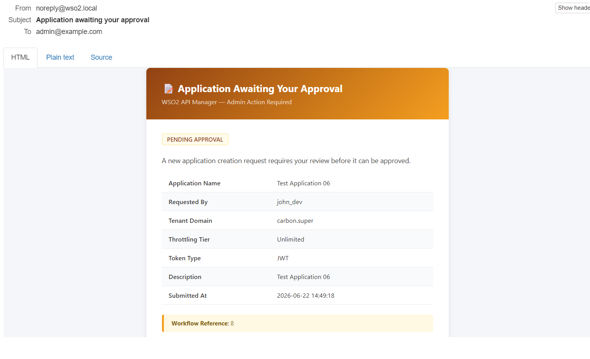
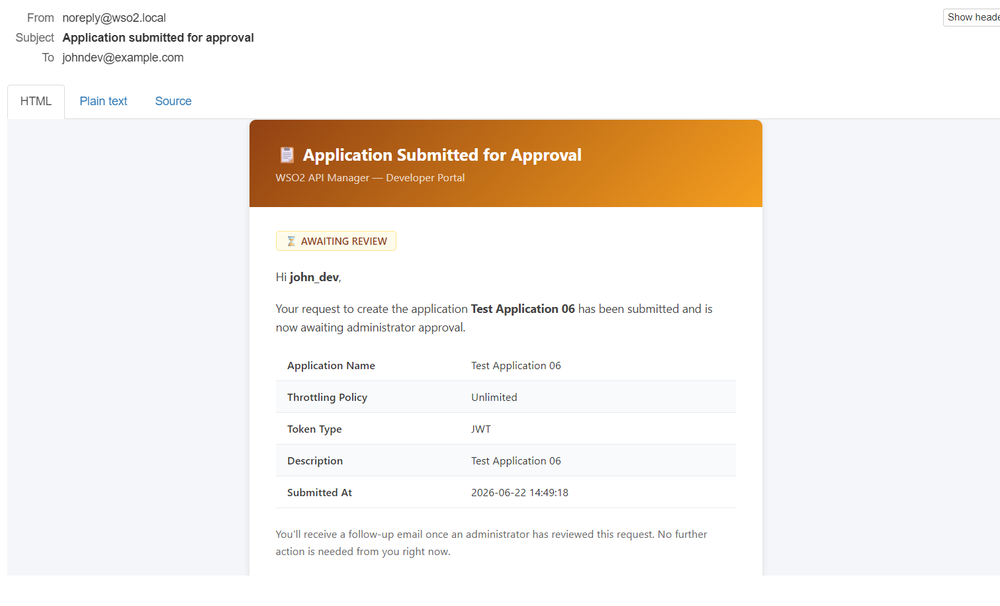
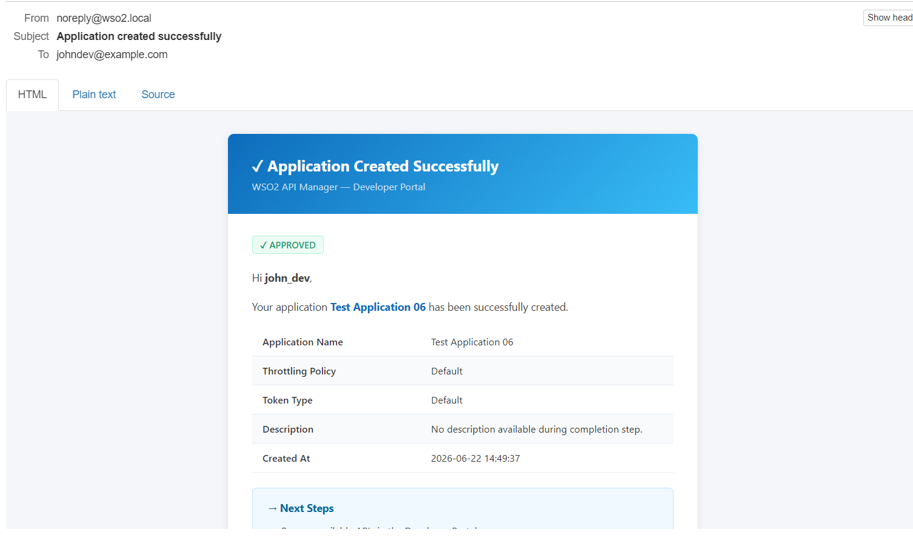
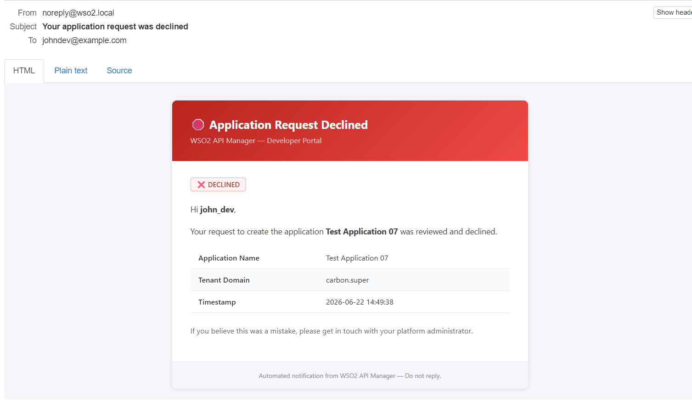
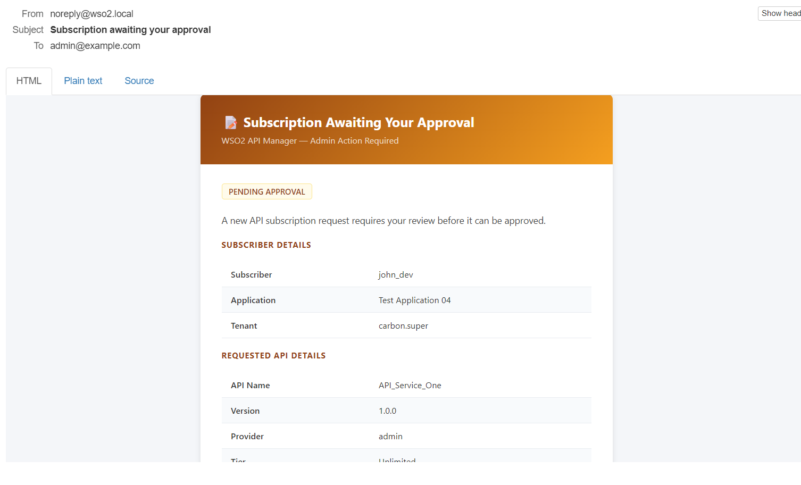
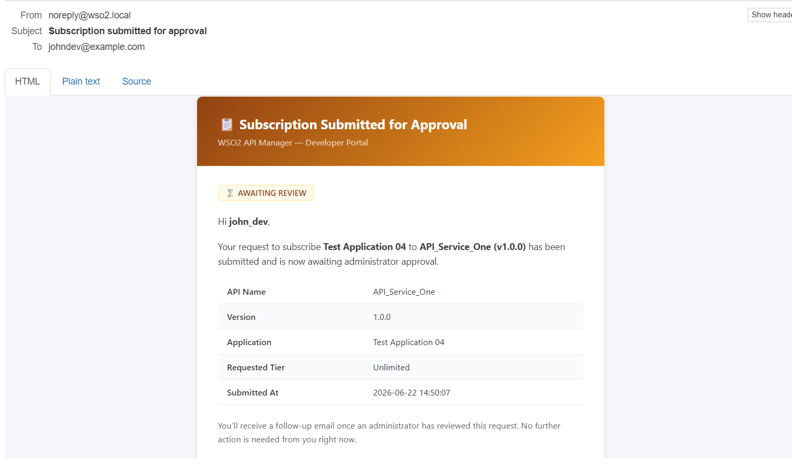
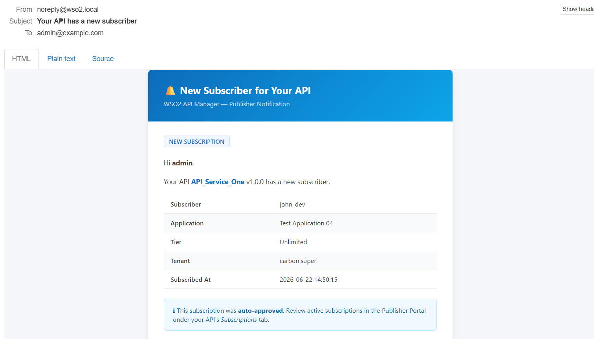
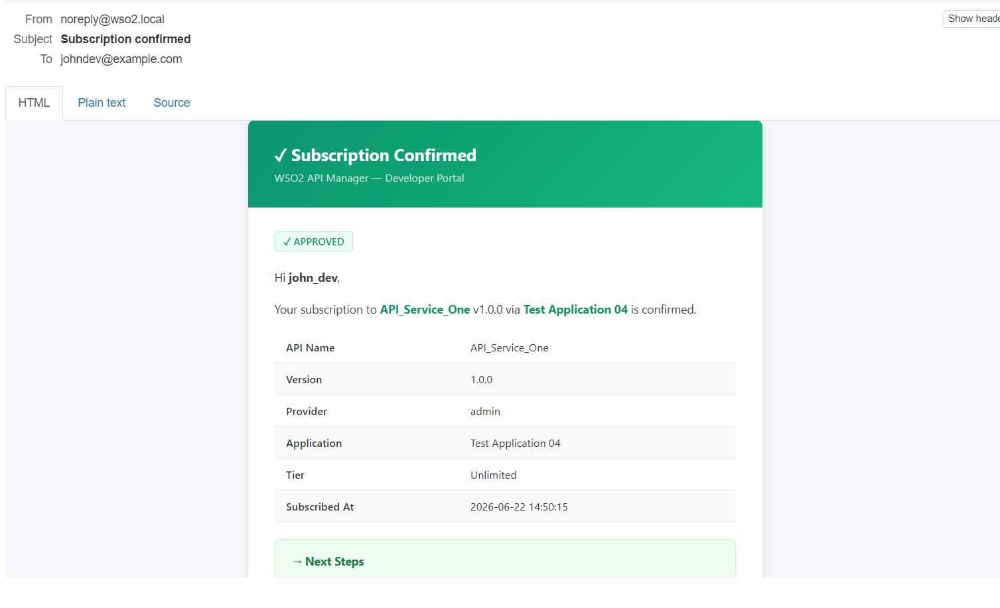
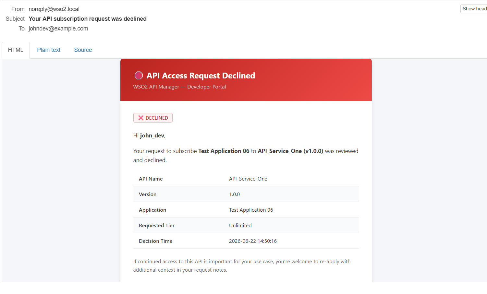

# WSO2 APIM — Custom Application & Subscription Approval Executors

[](https://img.shields.io/badge/Java-17-orange)
[](https://img.shields.io/badge/WSO2-API_Manager_4.2.0-red)
[](https://img.shields.io/badge/Maven-3.6+-blue)
[](https://img.shields.io/badge/OSGi-Equinox_3.14-green)
[](https://img.shields.io/badge/License-MIT-success)

A production-grade **OSGi bundle** for **WSO2 API Manager 4.2.0** that replaces the platform's default auto-approval behavior for application creation and API subscription with a **manual administrator approval workflow**, complete with branded HTML email notifications at every lifecycle stage: submission, approval, and rejection.

Built as a companion to [`wso2-usersignup-workflow`](../wso2-usersignup-workflow), this project applies the same battle-tested patterns — the `ConcurrentHashMap` email cache, the asynchronous SMTP dispatch layer, the zero-dependency HTML renderer, and the XSS escaping hardening — to two additional workflow interception points in the APIM lifecycle.

---

## Table of Contents

- [Why This Project Exists](#why-this-project-exists)
- [What It Does](#what-it-does)
- [Architecture](#architecture)
    - [System Diagram](#system-diagram)
    - [Component Responsibilities](#component-responsibilities)
- [Workflow Lifecycle](#workflow-lifecycle)
    - [Stage 1 — Submission (execute)](#stage-1--submission-execute)
    - [Stage 2 — Decision (complete)](#stage-2--decision-complete)
    - [Publisher Notification Policy](#publisher-notification-policy)
    - [Why super() Is Always Called First](#why-super-is-always-called-first)
- [Data Layer: DTO Asymmetry](#data-layer-dto-asymmetry)
- [Email Templates](#email-templates)
    - [Template Inventory](#template-inventory)
    - [Visual Design System](#visual-design-system)
    - [Why No Thymeleaf or FreeMarker](#why-no-thymeleaf-or-freemarker)
- [XSS Protection](#xss-protection)
    - [What the Escaper Covers](#what-the-escaper-covers)
    - [The Equals Sign Gap](#the-equals-sign-gap)
    - [What Is Deliberately Not Escaped](#what-is-deliberately-not-escaped)
- [Email Dispatch: Async Architecture](#email-dispatch-async-architecture)
- [The Email Cache: Surviving DTO Skeleton and User Account Changes](#the-email-cache-surviving-dto-skeleton-and-user-account-changes)
    - [The Problem](#the-problem)
    - [Why Manual Approval Makes This Critical](#why-manual-approval-makes-this-critical)
    - [The Fix](#the-fix)
    - [Cache Schema](#cache-schema)
    - [Cache Lifecycle](#cache-lifecycle)
- [Technology Stack](#technology-stack)
- [Project Structure](#project-structure)
- [Requirements](#requirements)
- [Build and Deploy](#build-and-deploy)
    - [Build](#build)
    - [Verify OSGi Isolation](#verify-osgi-isolation)
    - [Deploy to WSO2 APIM](#deploy-to-wso2-apim)
    - [Register the Executors](#register-the-executors)
    - [Verify Admin Approval Is Engaged](#verify-admin-approval-is-engaged)
- [Configuration](#configuration)
- [Test Suite](#test-suite)
    - [CustomApplicationExecutorTest](#customapplicationexecutortest)
    - [CustomSubscriptionExecutorTest](#customsubscriptionexecutortest)
    - [HtmlTemplatesTest](#htmltemplatestest)
    - [EmailUtilTest](#emailutiltest)
    - [Running the Tests](#running-the-tests)
- [The Development Journey: Problems Faced and Solved](#the-development-journey-problems-faced-and-solved)
    - [1. OSGi Classloader Isolation](#1-osgi-classloader-isolation)
    - [2. Blocking the Developer Portal Request Thread](#2-blocking-the-developer-portal-request-thread)
    - [3. Building a Hermetic Test Suite Without Infrastructure](#3-building-a-hermetic-test-suite-without-infrastructure)
    - [4. The Silent Decision-Email Bug](#4-the-silent-decision-email-bug)
    - [5. The XSS Escaping Gap](#5-the-xss-escaping-gap)
    - [6. DTO Shape Asymmetry](#6-dto-shape-asymmetry)
    - [7. Choosing the Right Base Class](#7-choosing-the-right-base-class)
- [Known Limitations and Future Work](#known-limitations-and-future-work)
- [Troubleshooting](#troubleshooting)
- [License](#license)

---

## Why This Project Exists

WSO2 API Manager ships with two default simple-approval executors — `ApplicationCreationSimpleWorkflowExecutor` and `SubscriptionCreationSimpleWorkflowExecutor` — that **auto-approve every request the moment it is submitted**. This is functionally complete but operationally silent and ungoverned:

| Problem | Impact |
|---|---|
| No review step before approval | Anyone can create an application or subscribe to any published API with zero human oversight |
| No admin notification | An administrator has no way of knowing an application was created or a subscription was bound, short of manually browsing the Admin Portal |
| No developer notification | A developer who creates an application or subscribes receives no confirmation and no visibility into whether the action is still pending |
| No publisher notification | An API publisher has no idea a new consumer just connected to their API — they find out only when usage appears in analytics |
| No rejection path | If an administrator manually reverses an auto-approved request, none of the affected parties are told what happened or why |

For any organization where application creation or API subscription requires real human sign-off — billing approval, security review, partner onboarding, compliance checks — auto-approval is not optional to fix. It is the wrong default outright. This project replaces it with WSO2's own **manual-approval workflow base classes** and layers a full set of branded, informative HTML email notifications on top, covering every actor and every outcome at every stage of the now three-stage lifecycle.

---

## What It Does

This extension intercepts two workflow points in the APIM lifecycle and holds every request **pending administrator approval** before it takes effect:

**Application Creation Workflow**
- When a developer creates an application via the Developer Portal, the request is held pending (not auto-approved). The administrator receives an alert that a decision is needed; the developer receives a confirmation that their request was received and is under review.
- When the administrator approves, **only the developer** receives a "created successfully" notification. The administrator made the decision themselves and does not receive a follow-up confirmation of their own action.
- When the administrator rejects, **only the developer** receives a "request declined" notification. The administrator is not notified of the outcome of their own decision.

**Subscription Creation Workflow**
- When a developer subscribes an application to an API, the subscription is held pending. The administrator receives an alert; the subscriber receives a "submitted" confirmation. The API publisher is deliberately **not** notified at this stage — a pending request has not yet granted anyone access to their API.
- When the administrator approves, **the subscriber and the API publisher** receive notifications. The administrator is not notified of their own approval decision.
- When the administrator rejects, **only the subscriber** receives a rejection notification. The API publisher is not notified (a rejected subscription granted no one any access), and the administrator is not notified of their own rejection decision.

Across both workflows, all thirteen emails share a consistent visual design system, are rendered with zero external templating dependencies, are dispatched asynchronously so SMTP latency never blocks the Developer Portal, and are hardened against HTML injection from user-controlled fields.

A **resilience mechanism** — the email cache — ensures that decision emails are still delivered even when the affected user's account can no longer be resolved by the time the administrator's decision is processed. Under manual approval, a request can sit pending for hours or days; this is no longer a theoretical edge case but a routinely encountered scenario at any realistic request volume.

---

## Architecture

### System Diagram

```
WSO2 API Manager Runtime (OSGi / Eclipse Equinox)
│
│  Developer Portal — developer creates application / requests subscription
│       │
│       ▼
│  WorkflowExecutorFactory resolves the configured executor class
│  [ Bundle deployed as JAR in repository/components/dropins/ ]
│       │
│       ├── CustomApplicationExecutor
│       │     extends ApplicationCreationApprovalWorkflowExecutor
│       │
│       └── CustomSubscriptionExecutor
│             extends SubscriptionCreationApprovalWorkflowExecutor
│
│  ─────────────── STAGE 1: execute() — SUBMISSION ─────────────────────
│       │
│       ├── super.execute()
│       │     WSO2 persists request as CREATED / ON_HOLD
│       │     Request appears in Admin Portal task queue
│       │
│       ├── Resolve recipient emails via Carbon UserStoreManager
│       │     getUserClaimValue(username, EMAIL_CLAIM_URI)
│       │
│       ├── Cache resolved emails in pendingEmailCache
│       │     Key: workflowReference (numeric string)
│       │     Value: [creatorEmail, adminEmail, creator, appName, ...]
│       │
│       └── Dispatch emails asynchronously via EmailUtil
│             ├── Admin: "pending approval" alert
│             └── Developer/Subscriber: "submitted" confirmation
│
│  [ Request sits in Admin Portal task queue — minutes, hours, or days ]
│  [ Administrator reviews and approves or rejects the request ]
│
│  ─────────────── STAGE 2: complete() — DECISION ──────────────────────
│       │
│       ├── super.complete()
│       │     WSO2 persists final APPROVED / REJECTED status
│       │
│       ├── If APPROVED:
│       │     └── Send "created" email set
│       │           Application: Developer only (admin is not notified of their own decision)
│       │           Subscription: Subscriber + Publisher (admin is not notified)
│       │
│       ├── If REJECTED:
│       │     └── Send "rejected" email set
│       │           Application: Developer only (admin is not notified of their own decision)
│       │           Subscription: Subscriber only (neither admin nor publisher notified)
│       │
│       └── Evict cache entry for this workflowReference
│
└── SMTP relay (MailHog in development / corporate relay in production)
```

### Component Responsibilities

| Component | Extends / Implements | Responsibility |
|---|---|---|
| `CustomApplicationExecutor` | `ApplicationCreationApprovalWorkflowExecutor` | Intercepts application creation lifecycle; resolves two recipients (creator, admin) at submission only; at decision time only the creator is notified |
| `CustomSubscriptionExecutor` | `SubscriptionCreationApprovalWorkflowExecutor` | Intercepts subscription creation lifecycle; resolves three recipients (subscriber, admin, API publisher) at submission; at approval subscriber + publisher are notified; at rejection only subscriber is notified |
| `HtmlTemplates` | — | Zero-dependency HTML renderer for all thirteen email variants; owns the `esc()` XSS sanitizer and the shared CSS design system |
| `EmailUtil` | — | Accepts rendered HTML and queues it onto a single background `ExecutorService` thread; dispatches via `javax.mail` SMTP; exposes test-only synchronization hooks |

---

## Workflow Lifecycle

### Stage 1 — Submission (execute)

`execute()` is called immediately when a developer submits a request — before any approval occurs. The key contract is that `super.execute()` persists the request in a **CREATED / ON_HOLD** state rather than auto-approving it, which is the entire point of extending the `*ApprovalWorkflowExecutor` family instead of the `*SimpleWorkflowExecutor` family.

After `super.execute()` returns, the email notification layer runs:

- For **application creation**: the administrator receives an "Application Awaiting Your Approval" alert with full request details; the developer receives "Application Submitted for Approval" with a note that no further action is needed from them yet.
- For **subscription creation**: the administrator receives a "Subscription Awaiting Your Approval" alert; the subscriber receives "Subscription Submitted for Approval." The API publisher receives **nothing** — see [Publisher Notification Policy](#publisher-notification-policy).

Crucially, this is also the moment the email cache is populated. The developer is actively logged in and making the request, so their account and claims are guaranteed to be resolvable right now — even if they won't be by the time the administrator eventually acts.

### Stage 2 — Decision (complete)

`complete()` is the **normal terminal path for every single request** under manual approval. Unlike auto-approval (where `complete()` was rarely reached and only on explicit manual reversal), every application and every subscription now ends here, either approved or rejected. Neither outcome is more expected than the other.

The decision is read from `workflowDTO.getStatus()`:

```
APPROVED  →  "created" email set
              Application: developer only (admin decided — no self-notification)
              Subscription: subscriber + API publisher (admin not notified)
REJECTED  →  "rejected" email set
              Application: developer only (admin decided — no self-notification)
              Subscription: subscriber only (admin not notified; publisher never notified on rejection)
CREATED   →  no decision emails (intermediate state; should not reach complete() in this state)
```

For **subscription workflows**, `complete()` also restores sparse DTO fields from the cache before calling `super.complete()`. WSO2's base `SubscriptionCreationApprovalWorkflowExecutor.complete()` internally reads fields like `subscriber`, `apiName`, and `apiVersion` from the DTO — but in the `complete()` call these fields arrive as empty strings or nulls in the skeleton DTO that WSO2 reconstructs from persistence. Without the restoration step, `super.complete()` can throw a `NullPointerException` inside WSO2's own Gateway JMS dispatch logic. The cache restoration runs before `super.complete()` precisely to prevent this.

### Publisher Notification Policy

API publishers are notified **only when a subscription is approved** — never at submission, never at rejection.

This is a deliberate design choice, not an omission:

- A **pending** subscription request has not granted the subscriber any access to the publisher's API. Notifying the publisher of a request that may never be approved creates noise with no actionable signal.
- A **rejected** subscription request also has not granted anyone access. The publisher's API is unaffected; there is nothing publisher-relevant to report.
- An **approved** subscription is the first moment the publisher gains an actual new consumer on their API — this is the only event worth surfacing to them.

### Why super() Is Always Called First

Both `execute()` and `complete()` call their respective `super` method before any custom notification logic runs:

```java
WorkflowResponse response = super.execute(workflowDTO);   // WSO2 persists first
// ... email dispatch runs after
return response;
```

This ordering is not negotiable. If email dispatch ran first and the `super` call then failed — due to a database exception, a constraint violation, or any other reason — recipients would receive a "submitted" or "created" email for a request that was never actually committed to persistence. By running `super` first, we guarantee that any email that gets sent corresponds to a request that genuinely exists in the system.

---

## Data Layer: DTO Asymmetry

WSO2's two workflow DTO classes expose the same logical data through completely different APIs. This is an important detail if you are extending this project to cover additional lifecycle events.

**`ApplicationWorkflowDTO`** nests application details inside a child `Application` object:

```java
ApplicationWorkflowDTO appDTO = (ApplicationWorkflowDTO) workflowDTO;

String appName  = appDTO.getApplication().getName();
String tier     = appDTO.getApplication().getTier();
String tokType  = appDTO.getApplication().getTokenType();
String desc     = appDTO.getApplication().getDescription();
String creator  = appDTO.getUserName();
```

**`SubscriptionWorkflowDTO`** exposes the equivalent fields directly on the DTO itself — there is no nested object:

```java
SubscriptionWorkflowDTO subDTO = (SubscriptionWorkflowDTO) workflowDTO;

String appName    = subDTO.getApplicationName();   // flat field — no .getApplication()
String apiName    = subDTO.getApiName();
String apiVersion = subDTO.getApiVersion();
String apiProvider= subDTO.getApiProvider();
String subscriber = subDTO.getSubscriber();
String tier       = subDTO.getTierName();
```

Attempting to call `.getApplication()` on a `SubscriptionWorkflowDTO` will not compile; the accessor does not exist on that class. This is why the project splits into two executor classes rather than attempting a single shared abstraction.

**Workflow reference format:** WSO2's internal workflow reference parsing calls `Integer.parseInt()` on `workflowReference` in several code paths inside the base executor classes. Both the production configuration and all unit test stubs must use **purely numeric strings** (e.g. `"998877"`, `"776655"`) as `workflowReference` values. Arbitrary identifiers like `"wf-abc-123"` will cause an unhandled `NumberFormatException` inside WSO2's own code during `complete()` processing. The test suites in this project mirror that constraint deliberately.

---

## Email Templates

### Template Inventory

This project defines thirteen HTML templates in `HtmlTemplates.java`. Nine are actively dispatched by the executor `notify()` methods; four exist in the renderer but are **not currently triggered** by any executor code path — they are documented here as orphaned templates available for future use.

**Active templates — dispatched by executor notify() methods:**

| # | Template Key | Recipient | Sent When                                                  |
|---|---|---|------------------------------------------------------------|
| 1 | `admin_application_pending_approval` | Admin | Application submitted, awaiting review  |
| 2 | `developer_application_submitted` | Creator | Application submitted, awaiting review |
| 3 | `developer_application_created` | Creator | Application approved |
| 4 | `developer_application_rejected` | Creator | Application rejected |
| 5 | `admin_subscription_pending_approval` | Admin | Subscription submitted, awaiting review |
| 6 | `developer_subscription_submitted` | Subscriber | Subscription submitted, awaiting review |
| 7 | `publisher_subscription_created` | API Publisher | Subscription approved |
| 8 | `developer_subscription_created` | Subscriber | Subscription approved |
| 9 | `developer_subscription_rejected` | Subscriber | Subscription rejected |

**Orphaned templates — rendered in `HtmlTemplates.java` but never called by either executor:**

| # | Template Key | Intended Recipient | Note |
|---|---|---|---|
| 10 | `admin_application_created` | Admin | Admin is not notified of their own approval decision |
| 11 | `admin_application_rejected` | Admin | Admin is not notified of their own rejection decision |
| 12 | `admin_subscription_created` | Admin | Admin is not notified of their own approval decision |
| 13 | `admin_subscription_rejected` | Admin | Admin is not notified of their own rejection decision |

The four orphaned templates are fully rendered and styled — they would be ready to wire in if a future requirement called for admin decision-confirmation emails (e.g. for audit logging to a mailbox, or if the approving admin and a separate audit admin are different personas). They are retained in `HtmlTemplates.java` and covered by the `HtmlTemplatesTest` content suite, but they produce no emails in the current executor implementation.

There is no `publisher_subscription_pending_approval` template and no `publisher_subscription_rejected` template — see [Publisher Notification Policy](#publisher-notification-policy).

### Visual Design System

All thirteen templates share a single CSS design system defined in `HtmlTemplates.sharedCss()`, so a single style change propagates to every template simultaneously. The per-template variable is only the **header gradient color pair**, chosen to communicate intent at a glance:

| Stage / Outcome | Header Gradient | Visual Signal |
|---|---|---|
| Pending approval | `#92400e` → `#f59e0b` (amber/gold) | Attention required, actionable |
| Approved / Created | Blue or green tones | Positive, complete |
| Rejected / Declined | `#450a0a` → `#b91c1c` (deep red) | Negative outcome |

Every template includes:
- A **color-coded status badge** (`PENDING APPROVAL`, `✓ APPROVED`, `✗ DECLINED`) for instant inbox triage
- A **structured details table** (application/API name, tier, timestamp, workflow reference) using a consistent two-column layout
- A **workflow reference box** on the two admin submission-alert emails (`admin_application_pending_approval`, `admin_subscription_pending_approval`) for audit traceability — the admin decision emails are orphaned templates not currently dispatched, so in practice only the submission alerts carry this box
- A **"Next Steps" checklist** on the two developer-facing approval emails, guiding the developer through generating keys and calling the API — deliberately omitted from "submitted" emails because there is nothing actionable to suggest while a request is still pending
- Measured, non-alarming copy on rejection emails with a clear path to follow up, consistent with the same UX principle applied in the sibling signup-workflow project

CSS is **inlined** via a `<style>` block rather than linked externally because most email clients strip or ignore external stylesheet references entirely. Inlining is the only reliable way to guarantee styling renders consistently across inboxes.

### Why No Thymeleaf or FreeMarker

WSO2 API Manager runs on Eclipse Equinox, an OSGi container with strict classloader isolation between bundles. A templating library's classes are not visible across the OSGi module boundary unless extensively (and fragily) wired via `Import-Package` / `Export-Package` directives in the bundle manifest. An unresolved `Import-Package` causes the bundle to fail at Equinox resolution time with a `BundleException` — before a single line of your code runs. Even if the wiring succeeds, any version mismatch between the bundled library and an existing package already exported by another Carbon bundle causes a split-package conflict.

The trade-off is deliberate: plain Java string concatenation in `HtmlTemplates.java` in exchange for zero additional `Import-Package` entries and guaranteed deployment reliability. For a fixed set of thirteen templates whose structure never changes at runtime, this is the correct trade.

---

## XSS Protection

WSO2 APIM allows users to input free text for fields such as application names, descriptions, and API names. If a developer submits `<script>alert('xss')</script>` or `` as an application name, that value is passed directly to the executor's model map. Without escaping, the recipient's email client — or any webmail interface that renders HTML — becomes vulnerable to script injection or attribute hijacking.

Every dynamic value injected into any template in this project passes through `HtmlTemplates.esc(String)` before interpolation.

### What the Escaper Covers

| Character | Escaped To | Why |
|---|---|---|
| `&` | `&amp;` | Prevents breaking other entity references — escaped first to avoid double-encoding |
| `<` | `&lt;` | Prevents opening a new HTML tag |
| `>` | `&gt;` | Prevents closing into an unintended tag |
| `"` | `&quot;` | Prevents breaking out of a double-quoted attribute |
| `'` | `&#39;` | Prevents breaking out of a single-quoted attribute |
| `=` | `&#61;` | Closes the bare-attribute injection gap — see below |

### The Equals Sign Gap

Escaping `<` and `>` prevents a payload like `` from being parsed as a real `` element. However, without escaping `=`, the literal substring `onerror=alert(1)` survives intact in the rendered HTML output. In certain rendering contexts — particularly legacy or permissive email clients — this can still superficially resemble a live HTML attribute. Escaping `=` to `&#61;` ensures the payload cannot even take that form:

```
Input:   
Without = escaping:  &lt;img src=x onerror=alert(1)&gt;   ← onerror= still intact
With = escaping:     &lt;img src&#61;x onerror&#61;alert(1)&gt;  ← fully neutralized
```

The `HtmlEscaping` test suite in `HtmlTemplatesTest` has a dedicated regression test for this exact case: `bareAttributeInjectionGapIsClosedByEscapingEquals()`.

### What Is Deliberately Not Escaped

| Character | Why Not Escaped |
|---|---|
| `/` (forward slash) | Values may appear near URLs in `description` fields. Escaping `/` would corrupt every `https://...` link the moment the field was touched. |
| `` ` `` (backtick) | Matters for JavaScript template-literal injection, not HTML rendering. Irrelevant in the email context. |

---

## Email Dispatch: Async Architecture

`EmailUtil.sendHtmlEmail()` is called from the workflow executor methods — both of which run on the HTTP request thread that the Developer Portal's UI is waiting on. Performing SMTP I/O synchronously on this thread would mean that SMTP latency (network round-trips, TLS handshakes), a slow mail server, or an unreachable host would directly and visibly degrade the Developer Portal's responsiveness for an action that has nothing to do with email delivery.

`EmailUtil` solves this with a single background `ExecutorService`:

```
Workflow thread (Developer Portal HTTP request)
│
├── calls EmailUtil.sendHtmlEmail(to, subject, templateName, model)
│     │
│     ├── validates toAddress is non-null/non-empty — returns immediately if blank
│     ├── submits a Runnable to the internal single-thread ExecutorService
│     └── returns immediately — no SMTP I/O has occurred yet
│
Background thread (ExecutorService worker)
│
├── reads SMTP configuration from system properties
├── calls HtmlTemplates.render(templateName, model) → HTML string
├── constructs javax.mail MimeMessage
├── calls Transport.send(message) — blocks here during actual SMTP I/O
├── increments completedSendCount (for test synchronization)
└── catches and logs any Exception without propagating — a failed send
      never crashes the background thread or affects the caller
```

**Test-only hooks:** Because `sendHtmlEmail()` returns before any SMTP activity begins, naively asserting `wiser.getMessages().size() == 2` immediately after calling it is a race condition. `EmailUtil` exposes two package-private methods for test synchronization:

- `awaitSentCount(int expectedCount, long timeoutMillis)` — polls `completedSendCount` with a timeout rather than sleeping a fixed duration
- `awaitWorkerIdleForTests(long timeoutMillis)` — submits a sentinel `CountDownLatch` task to the executor and waits for it to be processed, guaranteeing all previously submitted tasks have completed

These methods have package-private visibility — they are invisible to production code in any other package and do not appear in any non-test call path.

---

## The Email Cache: Surviving DTO Skeleton and User Account Changes

This is the most important architectural decision in the project. It directly parallels the fix developed in the companion `wso2-usersignup-workflow` project and is even more consequential here because of the timing gap that manual approval introduces.

### The Problem

At `complete()` time, WSO2 reconstructs a **skeleton DTO** from its persistence layer. For both `ApplicationWorkflowDTO` and `SubscriptionWorkflowDTO`, this skeleton DTO has several fields that were populated at `execute()` time now arriving as `null` or empty string. For the subscription DTO, this includes fields that WSO2's own `super.complete()` internally reads — meaning the skeleton must be corrected before calling `super`, not after.

Additionally, even when the DTO fields are present, the live Carbon user-store lookup used to resolve email addresses can fail:

```java
// This can throw UserStoreException at complete() time if the account
// was deleted, disabled, or reassigned between execute() and complete()
String email = userStoreManager.getUserClaimValue(username, EMAIL_CLAIM_URI, null);
```

### Why Manual Approval Makes This Critical

Under the original auto-approval configuration, `complete()` was typically called within milliseconds of `execute()`. The window for a user account to change in that time was negligible — a genuine edge case.

Under manual admin approval, **every single request** sits in the Admin Portal's task queue for however long it takes an administrator to review it. This is realistically minutes, hours, or days. In that window:

- A contractor who submitted a request may have their account deactivated before the admin gets around to reviewing it
- A developer may change teams and be moved to a different tenant
- A user may be deleted as part of an offboarding process

These are no longer edge cases. They are routine occurrences at any meaningful request volume. If the email lookup fails at `complete()` time and is caught by the outer `try/catch`, the decision email is simply never sent — with no visible symptom beyond a buried log line. The requester, who was told their request was under review and to wait for an email, receives nothing.

### The Fix

The `pendingEmailCache` — a `static ConcurrentHashMap<String, String[]>` — is populated during `execute()`, at the one moment when the requesting user is guaranteed to be active and their claims resolvable:

```java
// execute() — user is logged in, claims are guaranteed resolvable
String creatorEmail = getEmailInternally(creator, tenantDomain);
String adminEmail   = getEmailInternally("admin", tenantDomain);

pendingEmailCache.put(workflowRef, new String[]{
    creatorEmail, adminEmail, creator, appName
});
```

At `complete()` time, the cache is consulted before any live lookup:

```java
// complete() — user may no longer exist; read from cache first
String[] cached = pendingEmailCache.get(workflowRef);
if (cached != null) {
creatorEmail = cached[0];
adminEmail   = cached[1];
        }
// fall back to live lookup only if cache misses
```

### Cache Schema

**Application cache entry** — `String[4]`:

| Index | Content |
|---|---|
| `[0]` | Creator email address |
| `[1]` | Admin email address |
| `[2]` | Creator username (for DTO field restoration) |
| `[3]` | Application name (for DTO field restoration) |

**Subscription cache entry** — `String[10]`:

| Index | Content |
|---|---|
| `[0]` | Subscriber email address |
| `[1]` | Admin email address |
| `[2]` | API provider email address |
| `[3]` | Subscriber username |
| `[4]` | API name |
| `[5]` | Application name |
| `[6]` | API version |
| `[7]` | API provider username |
| `[8]` | Tier name |
| `[9]` | Tenant domain |

Indexes 3–9 in the subscription cache are used by `complete()` to restore the skeleton DTO fields before calling `super.complete()`.

### Cache Lifecycle

```
execute()    →   pendingEmailCache.put(workflowRef, data)
complete()   →   pendingEmailCache.get(workflowRef)   [read]
                 pendingEmailCache.remove(workflowRef)  [evict — in finally block]
```

The `remove()` call is in a `finally` block inside `complete()`, ensuring the entry is always evicted whether the notification logic succeeds, throws, or is bypassed. This prevents memory accumulation if `complete()` is called without a prior `execute()` for the same reference, and ensures the cache does not grow unboundedly.

**Clustered deployment note:** The `pendingEmailCache` is an in-process JVM map. In a horizontally scaled, multi-node WSO2 deployment without sticky sessions, `execute()` may run on Node A and `complete()` on Node B — the cache lookup on Node B will miss. The code gracefully falls back to a live user-store lookup in this case. For fully resilient clustered deployments, the cache could be migrated to WSO2's distributed Hazelcast layer or a shared database table. See [Known Limitations](#known-limitations-and-future-work).

---

## Technology Stack

| Layer | Choice | Rationale |
|---|---|---|
| Language | Java 17 | Matches WSO2 APIM 4.2.0 / Carbon Kernel's supported JDK range (11–17) |
| Build | Maven 3.6+ | Standard for WSO2 Carbon component development |
| Packaging | Apache Felix `maven-bundle-plugin` 5.1.8 | Generates the OSGi `MANIFEST.MF` required for Equinox bundle resolution |
| Email transport | `javax.mail` 1.6.2 | Already exported by the WSO2 Carbon runtime — embedding an alternative risks split-package conflicts |
| HTML rendering | Plain Java string concatenation | Zero external runtime dependencies — no `Import-Package` additions needed; see [Why No Thymeleaf or FreeMarker](#why-no-thymeleaf-or-freemarker) |
| Workflow base classes | `ApplicationCreationApprovalWorkflowExecutor`, `SubscriptionCreationApprovalWorkflowExecutor` | WSO2's own manual-approval classes — requests stay pending until an admin decides |
| User claim resolution | Carbon `UserStoreManager` / `ServiceReferenceHolder` | The native WSO2 mechanism for resolving user email addresses and profile claims |
| Async email dispatch | Single-thread `ExecutorService` | Decouples SMTP latency from the Developer Portal's HTTP response thread |
| Unit testing | JUnit 5.10 + Mockito 5.11 | Modern, well-supported; good `@Nested` / parameterized-test ergonomics; Mockito 5 supports static mocking without a separate `mockito-inline` dependency |
| Test SMTP server | SubEthaSMTP / Wiser 3.1.7 | `javax.mail`-native in-process SMTP server — no external infrastructure needed for `mvn test`; no `jakarta.mail` conflict |
| Local email inspection | MailHog | Containerized SMTP catcher with a web UI for visually reviewing rendered emails during development |

---

## Project Structure

```
wso2-custom-executor/
│
├── pom.xml                                               # Maven build + OSGi bundle configuration
│
├── src/
│   ├── main/java/com/mycompany/wso2/workflow/
│   │   ├── CustomApplicationExecutor.java                # Application creation hooks + email cache
│   │   ├── CustomSubscriptionExecutor.java               # Subscription creation hooks + DTO restoration + email cache
│   │   ├── EmailUtil.java                                # Async SMTP dispatch layer + test synchronization hooks
│   │   └── HtmlTemplates.java                            # Zero-dependency HTML renderer + esc() sanitizer
│   │
│   └── test/java/com/mycompany/wso2/workflow/
│       ├── CustomApplicationExecutorTest.java            # Hermetic unit suite (Mockito static mocks)
│       ├── CustomSubscriptionExecutorTest.java           # Hermetic unit suite (Mockito static mocks)
│       ├── EmailUtilTest.java                            # Real SMTP integration suite (SubEthaSMTP Wiser)
│       └── HtmlTemplatesTest.java                        # Template content + XSS escaping + design system suite
│
└── target/
    └── com.mycompany.wso2.workflow-1.0.0.jar             # Compiled OSGi bundle, ready for dropins/
```

---

## Requirements

- **JDK 17** — WSO2 Carbon explicitly supports JDK 11–17. JDK 21+ will cause the server to fail startup.
- **Apache Maven 3.6+**
- **WSO2 API Manager 4.2.0** — local or remote target instance
- **Docker** (optional) — for running MailHog during local development to visually inspect rendered emails

---

## Build and Deploy

### Build

```bash
mvn clean install
```

This compiles both executors, runs the full hermetic unit and integration test suite, and packages the result as an OSGi bundle via `maven-bundle-plugin`. The output artifact is:

```
target/com.mycompany.wso2.workflow-1.0.0.jar
```

### Verify OSGi Isolation

Confirm that no external templating library leaked into the compiled artifact:

```bash
# Linux / macOS
jar tf target/com.mycompany.wso2.workflow-1.0.0.jar | grep -E "thymeleaf|freemarker|velocity"

# Windows
jar tf target/com.mycompany.wso2.workflow-1.0.0.jar | findstr /i "thymeleaf freemarker velocity"
```

Expected output: **empty**. Any match indicates a dependency that will fail at Equinox bundle resolution time.

### Deploy to WSO2 APIM

```bash
# 1. Remove any previously deployed version
rm -f $APIM_HOME/repository/components/dropins/com.mycompany.wso2.workflow-1.0.0.jar

# 2. Clear the stale OSGi bundle cache
#    This step is easy to forget and is the most common cause of "changes not reflecting"
rm -rf $APIM_HOME/work/osgi/*
rm -rf $APIM_HOME/tmp/*

# 3. Deploy the new build
cp target/com.mycompany.wso2.workflow-1.0.0.jar $APIM_HOME/repository/components/dropins/

# 4. Restart the server with --clean to force fresh bundle resolution
cd $APIM_HOME/bin
./api-manager.sh --clean
```

On Windows, the equivalent sequence uses `Remove-Item`, `Copy-Item`, and `api-manager.bat --clean`.

### Register the Executors

**Preferred — `deployment.toml`:**

```toml
[apim.workflow_extensions]
application_creation = "com.mycompany.wso2.workflow.CustomApplicationExecutor"
subscription_creation = "com.mycompany.wso2.workflow.CustomSubscriptionExecutor"
```

**Legacy fallback — `workflow-extensions.xml`:**

```xml
<WorkFlowExtensions>
    <ApplicationCreation executor="com.mycompany.wso2.workflow.CustomApplicationExecutor"/>
    <SubscriptionCreation executor="com.mycompany.wso2.workflow.CustomSubscriptionExecutor"/>
</WorkFlowExtensions>
```

The class names are unchanged regardless of which approval base class the executors extend internally. When switching from auto-approval to manual approval (or vice versa), only the `.java` source and the redeployed `.jar` change — no configuration edits are required.

### Verify Admin Approval Is Engaged

After deploying, confirm that manual approval is working end-to-end before relying on it in production:

**Application workflow:**
1. Create an application via the Developer Portal. The application's **Status** field should immediately show `INACTIVE (Waiting for approval)` rather than becoming active.
2. Sign in to the Admin Portal (`https://<host>:9443/admin`) and navigate to **Tasks → Application Creation**. The new request should appear there, pending.
3. Approve or reject it. Confirm the corresponding email lands (check MailHog in development), and that the Developer Portal status updates accordingly.

**Subscription workflow:**
1. Subscribe an application to a published API via the Developer Portal. The subscription should show status `ON_HOLD` in the application's credentials page rather than immediately becoming active.
2. Navigate to **Tasks → Subscription Creation** in the Admin Portal. The pending subscription should be listed.
3. Approve or reject it. Confirm emails land and the subscription status transitions to `UNBLOCKED` (approved) or the subscription disappears (rejected).

---

## Configuration

SMTP connection details are read from JVM system properties at send time, with safe local-development defaults:

| System Property | Default | Purpose |
|---|---|---|
| `email.smtp.host` | `localhost` | SMTP server hostname or IP |
| `email.smtp.port` | `1025` | SMTP server port |
| `email.smtp.from` | `noreply@wso2.local` | The `From` address on all outgoing emails |

Set these via `-D` flags on WSO2 server startup — for example, in `wso2server.sh` or `wso2server.bat`:

```bash
-Demail.smtp.host=smtp.mycompany.com
-Demail.smtp.port=587
-Demail.smtp.from=apim-notifications@mycompany.com
```

Or via your container / orchestration platform's environment variable injection, if the startup script reads `$JAVA_OPTS`.

**Local development with MailHog:**

```bash
docker run -d -p 1025:1025 -p 8025:8025 mailhog/mailhog
```

The defaults (`localhost:1025`) point directly at MailHog's SMTP listener. Rendered emails are visible in the MailHog web UI at `http://localhost:8025`.

---

## Test Suite

The project maintains four deliberately separate test classes, each verifying a different layer of the stack with different infrastructure requirements.

### CustomApplicationExecutorTest

**Infrastructure:** None — fully hermetic. Runs on every `mvn test`.

**What is mocked:** `APIUtil` (static), `ServiceReferenceHolder` (static), `EmailUtil` (static), `ApiMgtDAO` (static), `RealmService`, `UserRealm`, `UserStoreManager` — the entire WSO2 runtime is mocked via Mockito's static mocking (`Mockito.mockStatic()`). Each static mock is opened in `@BeforeEach` and closed in `@AfterEach` to guarantee test isolation.

**Organized into `@Nested` groups:**

| Group | What It Verifies |
|---|---|
| `ExecuteStage` | Correct "pending approval" + "submitted" emails sent on submission; "created" templates never sent at `execute()` time; missing admin claim skips admin email but still sends developer email; missing creator claim skips developer email but still sends admin email; user-store exceptions are suppressed without crashing `execute()` |
| `CompleteStage` | `APPROVED` status sends "created" email to developer only (never admin-created template); `REJECTED` status sends "rejected" email to developer only (never admin-rejected template); `CREATED` status at `complete()` sends no decision emails; user-store exceptions suppressed at `complete()`; cache recovery when creator record deleted between `execute()` and `complete()` — for both APPROVED and REJECTED outcomes; cache eviction verified via a second `complete()` call after first evicts the entry |

### CustomSubscriptionExecutorTest

**Infrastructure:** None — fully hermetic. Runs on every `mvn test`.

**Organized into `@Nested` groups:**

| Group | What It Verifies |
|---|---|
| `ExecuteStage` | "Pending approval" + "submitted" emails sent at submission; publisher never notified at submission; "created" templates never sent at `execute()` time; missing admin claim skips admin email only; user-store exceptions suppressed |
| `CompleteStage` | `APPROVED` sends publisher + subscriber "created" emails (never admin-created); `REJECTED` sends only subscriber "rejected" email (never publisher, never admin-rejected); `CREATED` status sends no decision emails; user-store exceptions suppressed; cache recovery when subscriber deleted before decision; cache recovery when publisher deleted before decision; no email when user-store throws and cache is empty |

### HtmlTemplatesTest

**Infrastructure:** None. Pure string-level assertions against rendered HTML output. Runs on every `mvn test`.

**Organized into `@Nested` groups:**

| Group | What It Verifies |
|---|---|
| `TemplateContent` | All thirteen templates render every expected field with no `null` literal leakage; missing fields fall back to `-` placeholder; unknown template key returns safe fallback markup; all thirteen templates render without throwing on a fully empty model |
| `HtmlEscaping` | Parameterized XSS payload suite (`<script>`, attribute-breakout via `onmouseover`, SQL-style quote injection, ``, pre-encoded entities); angle bracket escaping; the `=` escaping regression test; single-quote escaping; double-quote escaping; ampersand-first ordering to prevent double-encoding; forward-slash deliberately not escaped |
| `SharedDesignSystem` | Every template uses the shared `wrapper`/`footer` CSS classes and standard footer copy; every template declares `<!DOCTYPE html>` and `charset="UTF-8"` |

### EmailUtilTest

**Infrastructure:** SubEthaSMTP Wiser — an in-process SMTP server that starts on a randomly-assigned free port for each test and tears down afterward. No external infrastructure, no Docker, no network. Runs on every `mvn test`.

Assertions read **actual `MimeMessage` objects** from Wiser — real headers, real `Content-Type`, real parsed HTML bodies — rather than verifying that `Transport.send()` was called with certain arguments.

**Organized into `@Nested` groups:**

| Group | What It Verifies |
|---|---|
| `AsynchronousDispatch` | `sendHtmlEmail()` returns near-instantly regardless of SMTP latency; all thirteen templates dispatch without throwing |
| `EmailContent` | Wiser receives a well-formed message with correct `Subject`, `From`, recipient, `Content-Type: text/html`, and non-empty HTML body |
| `FailureResilience` | Unreachable SMTP target fails the send internally without throwing or hanging the caller |

**Race condition guard:** `sendHtmlEmail()` dispatches onto a background thread and returns before any SMTP activity begins. `EmailUtil.awaitSentCount(expectedCount, timeoutMillis)` polls a completion counter with a configurable timeout, rather than sleeping a fixed duration or asserting immediately against Wiser. This is the same timing discipline applied in `wso2-usersignup-workflow`.

### Running the Tests

```bash
# Run all tests
mvn test

# Run a specific test class
mvn test -Dtest=CustomApplicationExecutorTest

# Run a specific nested group
mvn test -Dtest="CustomApplicationExecutorTest\$CompleteStage"

# Run with coverage report (output: target/site/jacoco/index.html)
mvn verify
```

---

## The Development Journey: Problems Faced and Solved

### 1. OSGi Classloader Isolation

**Problem:** Thymeleaf or FreeMarker would have produced cleaner template code, but WSO2's Eclipse Equinox container enforces strict classloader isolation between OSGi bundles. A templating library's classes are not visible across the module boundary unless wired via `Import-Package` / `Export-Package` directives. An unresolved `Import-Package` causes a `BundleException` at bundle resolution time — before any application code runs. Even if wiring succeeds, a version mismatch with any package already exported by another Carbon bundle causes a split-package conflict.

**Resolution:** Zero external runtime dependencies beyond what Carbon already exports. HTML is built with plain Java string concatenation in `HtmlTemplates.java`. Trading templating ergonomics for deployment reliability is the right trade for a fixed set of thirteen templates.

### 2. Blocking the Developer Portal Request Thread

**Problem:** Both `execute()` and `complete()` run synchronously on the HTTP thread serving the Developer Portal request. Performing SMTP I/O inline on this thread means a slow mail server, network timeout, or TLS handshake delay directly degrades Developer Portal responsiveness — for an action (email delivery) that is entirely incidental to the workflow operation the user performed.

**Resolution:** `EmailUtil` queues every send onto a single background `ExecutorService`. `sendHtmlEmail()` returns immediately after submission; the actual `Transport.send()` call happens on the background thread. The test-only `awaitSentCount()` and `awaitWorkerIdleForTests()` hooks exist precisely because of this: asserting immediately after `sendHtmlEmail()` returns is a race condition, not a test.

### 3. Building a Hermetic Test Suite Without Infrastructure

**Problem:** Mocking `Transport.send()` via Mockito only proves the method was called — it cannot catch a bug where the rendered email body silently contains the literal string `"null"` instead of an application name, or where the `Content-Type` header is malformed.

GreenMail was evaluated as a test SMTP server and rejected: GreenMail's modern releases depend on `jakarta.mail`, which occupies a different package namespace from the `javax.mail` used throughout this project and required by the Carbon runtime. Mixing both on the test classpath causes split-package conflicts that make the test compilation itself unreliable.

**Resolution:** SubEthaSMTP's Wiser is a minimal, in-process SMTP server that depends only on `javax.mail`. It starts on an ephemeral port, receives real `MimeMessage` objects, and tears down after each test with no external infrastructure. Combined with `EmailUtil`'s `awaitSentCount()` synchronization hook, the `EmailUtilTest` suite asserts against real message content without any race conditions.

### 4. The Silent Decision-Email Bug

**Problem:** Under manual admin approval, every request sits pending in the Admin Portal for however long it takes a human to review it — realistically minutes, hours, or days. If the requesting user's account is deactivated, deleted, or reassigned during that window, the live `getUserClaimValue()` call inside `complete()` throws `UserStoreException`. Caught by the outer try/catch and logged, the decision email is simply never sent. The requester, who was told to wait for a decision email, receives nothing — with no visible symptom beyond a buried log line.

Under auto-approval, this window was milliseconds. Under manual approval, account changes during the review window are routine at any meaningful request volume. This transforms a theoretical edge case into a predictable production failure.

**Resolution:** The `pendingEmailCache` — a `static ConcurrentHashMap` — is populated during `execute()`, at the one moment when the requesting user is guaranteed to be active and their email claim resolvable. At `complete()` time, the cache is read first; the live user-store lookup is used only as a fallback. The cache entry is evicted in a `finally` block at the end of `complete()` to prevent memory accumulation.

### 5. The XSS Escaping Gap

**Problem:** The initial `esc()` implementation escaped only four characters: `&`, `<`, `>`, and `"`. This left two gaps:

1. **Single-quote attribute breakout:** a value like `x' onmouseover='alert(1)` could break out of a single-quoted HTML attribute because `'` was not escaped.
2. **Bare attribute injection:** `` has its `<` and `>` escaped, preventing it from parsing as a real `` element — but the substring `onerror=alert(1)` survived intact in the rendered output, superficially resembling a live HTML attribute in permissive rendering contexts.

**Resolution:** Added `'` → `&#39;` and `=` → `&#61;` to the escaper. The `HtmlEscaping` test suite includes dedicated regression tests for both: `singleQuotesAreEscapedToPreventAttributeBreakout()` and `bareAttributeInjectionGapIsClosedByEscapingEquals()`.

### 6. DTO Shape Asymmetry

**Problem:** `ApplicationWorkflowDTO` nests application fields inside a child `Application` object (`appDTO.getApplication().getName()`), while `SubscriptionWorkflowDTO` exposes equivalent fields directly on the DTO (`subDTO.getApplicationName()`). Attempting to build a shared abstract class or utility method that extracts fields generically from both DTO types fails at compile time — the accessor signatures are incompatible and there is no common interface.

**Resolution:** The project explicitly splits into two executor classes rather than attempting a forced abstraction. The `@SuppressWarnings("DuplicatedCode")` annotation on `CustomSubscriptionExecutor` documents this intentional duplication. The small amount of repeated workflow boilerplate is an acceptable cost for type safety and eliminates the alternative — brittle reflection, unsafe casts, or runtime `instanceof` chains.

### 7. Choosing the Right Base Class

**Problem:** WSO2 documentation commonly guides developers to extend `ApplicationCreationSimpleWorkflowExecutor` when building custom application or subscription workflows. The `execute()` method in the `*SimpleWorkflowExecutor` family, however, immediately transitions the request to `APPROVED` — it auto-approves. Extending these classes and adding emails produces a system with notifications, but still with no real approval gate. The request is already approved before the administrator has a chance to review it.

**Resolution:** Extend `ApplicationCreationApprovalWorkflowExecutor` and `SubscriptionCreationApprovalWorkflowExecutor` — WSO2's own shipped manual-approval classes. Their `execute()` implementations park the request in an `ON_HOLD` / pending state and register a human-actionable task in the Admin Portal's task queue. The custom executors in this project simply call `super.execute()` to get this correct behavior, then layer the notification logic on top.

---

## Known Limitations and Future Work

**Orphaned admin decision-confirmation templates**

Four templates — `admin_application_created`, `admin_application_rejected`, `admin_subscription_created`, `admin_subscription_rejected` — are fully implemented in `HtmlTemplates.java` and covered by `HtmlTemplatesTest`, but are never dispatched by either executor's `notify()` switch block. The current design does not notify the administrator of the outcome of their own decision. If a future requirement calls for admin decision-confirmation emails (for example, to a separate audit mailbox, or if approving admin and audit admin are different personas), these templates are ready to wire in by adding `EmailUtil.sendHtmlEmail(adminEmail, ..., "admin_application_created", model)` calls to the relevant `case` blocks in `notify()`.

**In-memory cache in clustered deployments**

The `pendingEmailCache` is a JVM-local `ConcurrentHashMap`. In a horizontally scaled WSO2 deployment without sticky sessions, `execute()` may run on Node A and `complete()` on a different Node B. The cache lookup on Node B will miss, causing a fallback to the live user-store lookup — which may fail if the user account has since changed.

The code handles this gracefully: a cache miss falls back to a live lookup, and a failed live lookup results in no email being sent (rather than a crash). For fully resilient clustered deployments, the cache could be migrated to WSO2's built-in distributed Hazelcast layer or a shared database table keyed by `workflowReference`.

**No SMTP authentication**

The current `EmailUtil` implementation connects to SMTP without authentication credentials. Corporate SMTP relays typically require SMTP AUTH. Adding authentication requires extending the `Properties` configuration with `mail.smtp.auth=true` and providing a `javax.mail.Authenticator` implementation, plus corresponding system properties for username and password.

**No TLS/STARTTLS**

Similarly, TLS is not currently configured. Production deployments connecting to an external relay should add `mail.smtp.starttls.enable=true` and handle the associated port change (typically 587 for STARTTLS, 465 for SMTPS).

---

## Troubleshooting

**No emails arriving, but requests are pending/approved correctly**

Check `$APIM_HOME/repository/logs/wso2carbon.log` for `javax.mail.AuthenticationFailedException` or `java.net.ConnectException`. If the startup `-D` properties are missing, the bundle defaults to `localhost:1025` — it is attempting to reach a local MailHog instance that may not be running.

**`null` literal appearing in email body**

The `allTemplatesRenderExpectedFieldsWithNoBlanksOrNullLiterals()` test actively prevents this. If you see a `null` in a rendered email, the model map is missing a key that the template expects. Verify that the workflow DTO fields the executor reads are actually populated in the version of WSO2 APIM you are targeting — WSO2 occasionally moves fields between DTO versions.

**Code changes not reflecting after redeployment**

OSGi bundles are aggressively cached by Equinox. Simply overwriting the `.jar` in `dropins/` is not sufficient. Stop the server, delete the contents of `$APIM_HOME/work/osgi/` and `$APIM_HOME/tmp/`, redeploy the JAR, and restart with `./api-manager.sh --clean`.

**Request not appearing in Admin Portal task queue**

Verify that the executor class names in `deployment.toml` (or `workflow-extensions.xml`) exactly match the deployed class names. A typo causes WSO2 to silently fall back to the default simple executor, which auto-approves without surfacing a task. Also verify that the bundle was deployed to `repository/components/dropins/` — not `lib/` or `plugins/`, which use different classloading strategies.

**`NumberFormatException` in logs during `complete()` processing**

This indicates a `workflowReference` value that is not a purely numeric string. WSO2's base executor classes call `Integer.parseInt(workflowReference)` internally. Ensure your test stubs and any external systems that trigger workflow callbacks use numeric-only reference IDs.

---

## License

This project is licensed under the MIT License — see the [LICENSE](LICENSE) file for details.